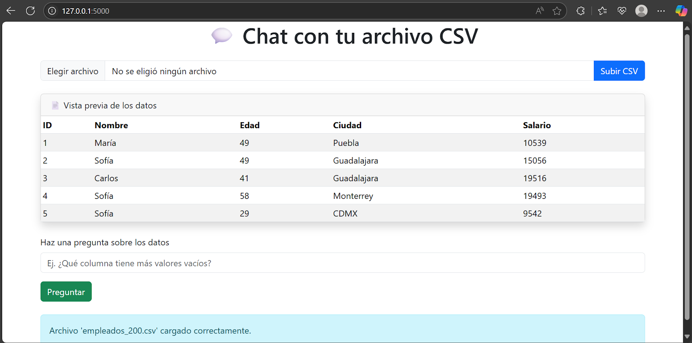
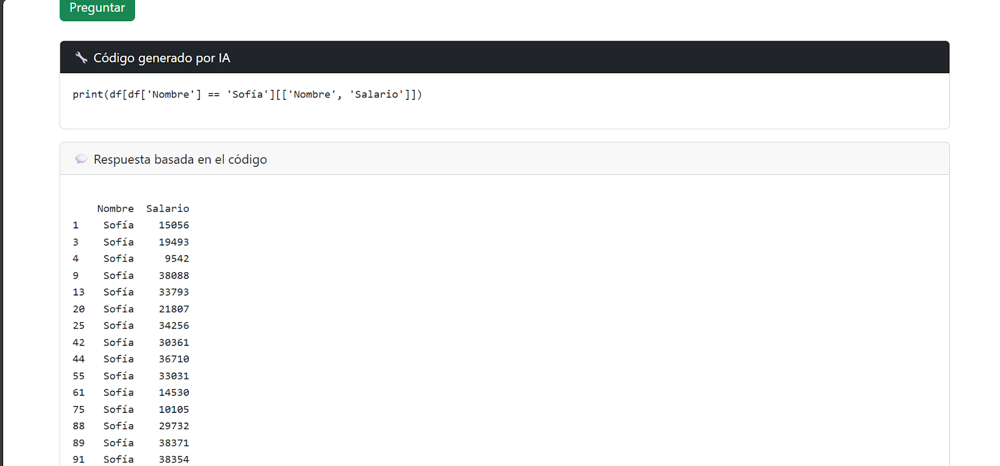

# Chatbot de Análisis de Datos con CSV

Este repositorio contiene el proyecto final de la materia Extracción de Conocimientos en Bases de Datos, donde se desarrolló una aplicación web con Flask que permite al usuario subir un archivo CSV y hacer preguntas directamente sobre sus datos, utilizando inteligencia artificial (Groq + DeepSeek) para interpretar las preguntas y generar código ejecutable en Python (Pandas).

## Equipo de desarrollo

* Janneth Santos Molina
* Patricio de Jesús Vargas Ramírez

## Instalación

Una vez clonado el repositorio, ejecuta la siguiente instrucción:

```
# Instalación de dependencias
pip install -r requirements.txt
```

Con las dependencias instaladas, inicia la aplicación con:

```
python app.py
```

Después de esto, puedes acceder a la aplicación desde tu navegador en: *http://localhost:5000*

Puedes usar el archivo datos_ejemplos_pokemon.csv ubicado en la raíz del proyecto para realizar pruebas con el sistema de preguntas.

### Capturas de pantalla

1. Subida de archivo CSV e ingreso de preguntas

2. Visualización del código generado por IA

### Estructura del proyecto

```
├── app.py                         # Archivo principal que contiene la lógica en Flask
├── datos_ejemplo_pokemon.csv
├── requirements.txt               # Dependencias del proyecto
├── static
│   └── styles.css                 # Estilos personalizados (opcional)
├── templates
│   └── index.html                 # Plantilla HTML de la aplicación
├── uploads                        # Carpeta donde se almacenan los archivos cargados
│   └── empleados_200.csv          # Archivo de ejemplo para pruebas
├── prueba_funcionamiento
│   ├── prueba_1.png               # Capturas de funcionamiento
│   ├── prueba_2.png
│   ├── prueba_3.png
├── README.md
```

### Tecnologías utilizadas

* Flask para la aplicación web.
* Pandas para el análisis de datos.
* Groq API como proveedor de modelo.
* DeepSeek R1 Distill Llama 70B como modelo de lenguaje para interpretar preguntas.
* Bootstrap para diseño web básico (no basado en ningún tema externo).

